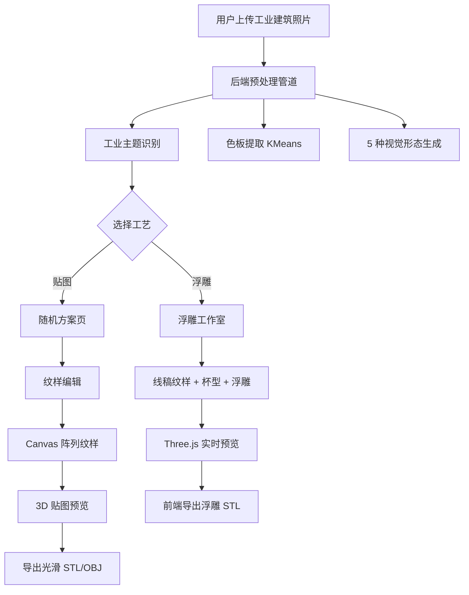
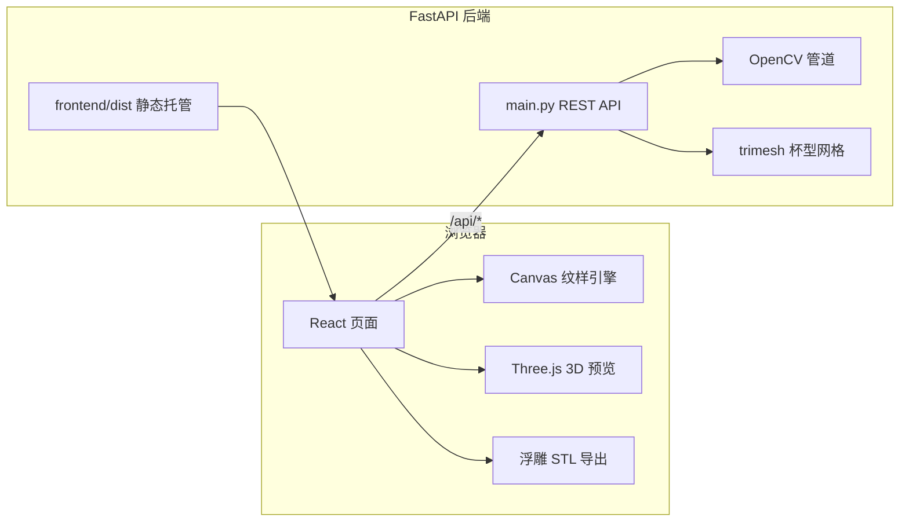

# 筑纹杯 CupForge — 项目 PRE 文档

> 工业文化 × 杯具文创 · 纹样设计与 3D 杯具定制 Web 应用

---

## 一、项目定位

### 1.1 一句话定位

**CupForge（筑纹杯）** 是一款面向 **工业建造文化** 的 **纹样生成与 3D 杯具定制** 在线工具：用户上传工业建筑照片，系统自动识别主题、提取视觉特征，生成可编辑纹样，并映射到可 3D 预览、可导出的杯型模型上。

### 1.2 目标用户与场景

| 维度 | 说明 |
|------|------|
| **目标用户** | 文创设计者、工业设计爱好者、3D 打印玩家、工业文化主题展览/课程参与者 |
| **核心场景** | 将「厂房、大桥、塔吊」等工业意象转化为杯身纹样，完成从照片 → 图案 → 3D 杯具的全流程 |
| **交付形态** | 浏览器内实时预览；导出 **STL** 用于 3D 打印或进一步建模 |

### 1.3 设计原则

- **文化主题明确**：聚焦工业建筑视觉语言，而非通用图片编辑器
- **算法 + 交互结合**：后端 CV 做特征提取，前端 Canvas/Three.js 做实时编辑与 3D 呈现
- **双工艺路径**：**贴图流程**（平面纹样贴附杯壁）与 **浮雕流程**（几何位移、可 3D 打印）并行
- **低门槛 Web 化**：无需安装本地软件，部署后一个链接即可使用

### 1.4 技术定位

| 层级 | 技术选型 | 职责 |
|------|----------|------|
| 后端 | Python · OpenCV · scikit-learn · FastAPI · trimesh | 图像预处理、主题识别、视觉形态生成、光滑杯型网格导出 |
| 前端 | React · TypeScript · Canvas 2D · Three.js | 纹样阵列编辑、实时预览、3D 交互、浮雕 STL 前端导出 |
| 部署 | Docker · GitHub · Render | 单容器托管前后端，公网访问 |

---

## 二、信息架构

### 2.1 站点地图（页面层级）

应用采用 **单页状态机**（`App.tsx` 中 `page` 状态），共 6 个主页面：

```
首页 (landing)
  └── 上传页 (upload)
        ├──【贴图流程】方案页 (schemes)
        │     └── 纹样编辑 (pattern-edit)
        │           └── 3D 预览·贴图 (cup-3d)
        │
        └──【浮雕流程】浮雕工作室 (relief-studio)
```

| 页面 | 文件 | 功能摘要 |
|------|------|----------|
| **首页** | `LandingPage.tsx` | 品牌展示、四步流程引导（上传→生成→编辑→预览）、案例轮播 |
| **上传页** | `UploadPage.tsx` | 上传工业建筑照片、显示识别标签、选择「贴图 / 浮雕」工艺 |
| **方案页** | `SchemesPage.tsx` | 基于上传图随机生成 6 套纹样方案缩略图，一键进入编辑 |
| **纹样编辑** | `PatternEditPage.tsx` | 取样框、阵列模式、配色、线稿参数，双栏实时预览 |
| **3D 预览·贴图** | `Cup3DPage.tsx` | 杯型捏制、材质/渐变、贴图区域、Three.js 预览、导出光滑 STL |
| **浮雕工作室** | `ReliefStudioPage.tsx` | 纹样 + 杯型 + 浮雕参数同屏编辑，导出 **带浮雕细节 STL** |

### 2.2 全局导航

- 顶部 `CyberHeader`：除首页外显示品牌与「首页 | 上传页」面包屑
- 页面间通过 `onNavigate` / 业务按钮跳转，**无 URL 路由**（状态保存在 React 内存中）

### 2.3 核心数据实体

| 实体 | 说明 | 生命周期 |
|------|------|----------|
| `session_id` | 后端会话 ID，关联一次上传的处理结果 | 后端内存 `_sessions`，服务重启后丢失 |
| `UploadResult` | 原图、色板、5 种视觉形态、识别主题 | 上传后写入前端 state |
| `SchemePreset` | 随机方案（形态、阵列、取样框、配色等） | 由 `session_id` 作种子生成，可复现 |
| `SampleBox` | 取样区域（位置、尺寸、旋转、形状） | 纹样编辑 / 浮雕页共享 |
| `CupEditorState` | 杯型控制点、壁厚、高度、材质、浮雕、表面区域 | 3D 页 / 浮雕页独立维护 |

### 2.4 配置与常量层

| 模块 | 路径 | 内容 |
|------|------|------|
| 后端全局参数 | `backend/config.py` | Canny 阈值、KMeans 色板、工业主题列表、杯型预设、阵列枚举 |
| 前端类型定义 | `frontend/src/types/index.ts` | 全站 TypeScript 接口 |
| 关键词 / 展示 | `frontend/src/constants/keywords.ts` | 建筑主题标签、首页案例 |
| 随机方案生成 | `frontend/src/constants/schemes.ts` | 方案池、浮雕默认参数 |

---

## 三、生成流程

### 3.1 总流程概览



### 3.2 后端图像处理管道

**入口**：`POST /api/upload` → `preprocess.run_pipeline()`

| 步骤 | 函数 / 模块 | 算法 |
|------|-------------|------|
| 1. 解码缩放 | `load_and_resize` | 最长边 ≤ 1024px |
| 2. 去噪增强 | `denoise_and_enhance` | 双边滤波 + CLAHE |
| 3. 边缘检测 | `detect_edges` | Canny（阈值可调） |
| 4. 轮廓清理 | `clean_contours` | 过滤小面积轮廓 |
| 5. 色板提取 | `extract_palette` | KMeans 5 色，过滤高亮背景 |
| 6. 视觉形态 | `expressions.generate_all_expressions` | 见下表 |
| 7. 主题识别 | `industrial_recognize.recognize_industrial_subject` | 启发式多特征打分 |

**5 种视觉形态（Visual Expression Forms）**：

| 形态 ID | 名称 | 实现要点 |
|---------|------|----------|
| `original` | 原图模式 | 预处理后彩色原图 |
| `outline` | 纯粹线稿 | Canny 边缘 → 白线黑底 |
| `pixel` | 复古像素化 | 降采样 + 色板量化 + 最近邻放大 |
| `halftone` | 报纸半调 | 灰度网屏圆点 |
| `silhouette` | 高反差剪影 | 形态学 + 填充 |

参数变更时：`POST /api/reprocess` → `reprocess_session()` 基于已有会话重算形态，无需重新上传。

### 3.3 工业主题识别

**模块**：`backend/pipeline/industrial_recognize.py`

- 支持 **10 类**工业主体：厂房、大桥、高楼、起重机、吊车、烟囱、管道、钢架、塔吊、脚手架
- 特征维度：区域边缘密度、Hough 线方向统计、横向条带强度（厂房）、网格平衡度（钢架/脚手架）等
- 低置信度时回退为 **「工业建筑」**（`INDUSTRIAL_SUBJECT_FALLBACK`）

识别结果用于：
- 上传页标签展示
- 随机方案标题关键词（`schemes.buildRandomSchemes`）
- 浮雕流程默认参数（`buildReliefDefaults`）

### 3.4 贴图流程（Texture Workflow）

```
上传 → 选「贴图」→ 方案页（6 套随机方案）
  → 纹样编辑（取样 + 阵列 + 配色）
  → 3D 预览（纹样作为纹理贴附杯壁）
  → 导出光滑杯型 STL/OBJ（后端 trimesh）
```

**纹样生成（前端）**：`patternEngine.ts`

1. `extractSample`：按取样框 + 形状（矩形/圆/三角/菱形/梯形）裁剪源图
2. `tilePattern`：8 种阵列模式平铺到预览画布
3. `applyColorMap`：自动 / 着色 / 自由配色

**8 种阵列模式**：普通平铺、水平镜像、垂直镜像、旋转万花筒、错位砖墙、移步互换、四轴中心对称、比例渐变

### 3.5 浮雕流程（Relief Workflow）

```
上传 → 选「浮雕」→ 直接进入浮雕工作室
  → 编辑线稿纹样（取样/阵列/线宽/细节）
  → 调整杯型、浮雕深度/方向、表面区域
  → Three.js 实时几何位移预览
  → 前端导出带浮雕 STL（cupStlExport.ts）
```

**浮雕几何原理**：

1. 纹样 Canvas → 灰度高度图（`canvasToHeightmap`）
2. 杯壁网格顶点沿 **外表面法线** 位移（`applyReliefDisplacement`）
3. 支持 **凸起 / 凹陷**、强度调节、多区域遮罩（`cupSurfaceRegions`）
4. STL 导出与 3D 预览共用同一套网格算法（288×360 细分级）

### 3.6 两条流程的导出差异

| 流程 | 导出内容 | 实现位置 | 是否含纹样几何 |
|------|----------|----------|----------------|
| 贴图 3D 页 | 光滑杯壁 STL/OBJ | 后端 `cup_mesh.py` + API | 否（仅杯型，纹样为视觉贴图） |
| 浮雕工作室 | 带浮雕 STL | 前端 `cupStlExport.ts` | **是（可 3D 打印纹样）** |

---

## 四、系统架构

### 4.1 整体架构图



### 4.2 API 接口

| 方法 | 路径 | 功能 |
|------|------|------|
| `GET` | `/health` | 健康检查（部署探活） |
| `GET` | `/api/config` | 前端初始化配置（阈值、枚举、杯型预设） |
| `POST` | `/api/upload` | 上传图片，返回 session + 形态 + 色板 + 识别 |
| `POST` | `/api/reprocess` | 按 session 重算视觉形态 |
| `POST` | `/api/cup/export/stl` | 导出光滑杯型 STL |
| `POST` | `/api/cup/export/obj` | 导出光滑杯型 OBJ |

### 4.3 目录结构

```
文创设计/
├── backend/
│   ├── config.py                 # 全局算法与杯型参数
│   ├── main.py                   # FastAPI 入口 + 生产静态托管
│   ├── pipeline/
│   │   ├── preprocess.py         # 图像预处理主管道
│   │   ├── expressions.py        # 5 种视觉形态
│   │   ├── industrial_recognize.py  # 工业主题识别
│   │   └── cup_mesh.py           # 回转体杯型网格（后端导出）
│   └── utils/encoding.py         # 图像 ↔ Data URI
├── frontend/src/
│   ├── App.tsx                   # 页面状态机与全局数据流
│   ├── pages/                    # 6 个主页面
│   ├── components/               # UI 组件（3D 预览、取样、配色等）
│   ├── engine/                   # 核心算法（纹样、杯型、浮雕、STL）
│   ├── api/client.ts             # 后端 API 封装
│   ├── constants/                # 方案、关键词、材质常量
│   └── types/index.ts            # 类型定义
├── Dockerfile                    # Render 部署
├── DEPLOY.md                     # 部署说明
└── PRE.md                        # 本文档
```

---

## 五、核心功能清单

### 5.1 图像理解与特征提取

- [x] 工业建筑照片上传（jpg/png 等）
- [x] 自动工业主题识别（10 类 + 低置信度回退）
- [x] KMeans 主色板提取（5 色 + 占比）
- [x] 5 种视觉形态一键切换
- [x] 线稿细节 / 像素粒度实时重算（节流请求后端）

### 5.2 纹样编辑

- [x] 可拖动 / 缩放 / 旋转的取样框（`sampleRegion.ts`）
- [x] 5 种取样形状裁剪
- [x] 8 种阵列平铺模式
- [x] 三种配色模式：自动色板 / 单色调 / 自由选色
- [x] 6 套随机纹样方案（基于 session 种子可复现）
- [x] 双栏实时预览（取样区 + 阵列结果）

### 5.3 3D 杯具定制

- [x] 5 种杯型预设：直杯、马克杯、茶杯、酒杯、花瓶
- [x] 贝塞尔曲线杯型轮廓编辑器（`CupProfileEditor`）
- [x] 杯高、壁厚参数调节
- [x] 5 种材质预设 + 纯色 / 渐变杯身
- [x] 杯壁多区域贴图/浮雕遮罩（`CupSurfaceRegionEditor`）
- [x] Three.js 轨道控制 3D 预览

### 5.4 浮雕与导出

- [x] 纹样 → 高度图 → 法线位移浮雕
- [x] 凸起 / 凹陷方向切换
- [x] 浮雕深度滑块
- [x] 贴图流程：导出光滑 STL/OBJ（后端）
- [x] 浮雕流程：导出可打印浮雕 STL（前端）
- [x] 杯底与杯壁等厚结构设计

### 5.5 在线部署

- [x] Docker 单容器构建（前端 build + 后端 run）
- [x] Render 免费 tier 部署
- [x] GitHub 代码托管与自动 redeploy

---

## 六、核心代码模块

### 6.1 后端

#### `backend/pipeline/preprocess.py` — 预处理主管道

```python
def run_pipeline(image_bytes, canny_t1, canny_t2, pixel_factor) -> dict:
    # 缩放 → 增强 → Canny → 轮廓 → 色板 → 形态 → 主题识别
```

返回 dict 含 `original`、`palette`、`expressions`、`detected_subject` 等，存入 `_sessions[session_id]`。

#### `backend/pipeline/industrial_recognize.py` — 主题识别

- 输入：BGR 图像
- 输出：`{ label: str, confidence: float }`
- 方法：多启发式特征加权打分，取得分最高标签

#### `backend/pipeline/expressions.py` — 视觉形态

- `apply_outline` / `apply_pixel` / `apply_halftone` / `apply_solid_silhouette`
- 像素化形态使用色板最近邻映射，保持工业图配色一致性

#### `backend/pipeline/cup_mesh.py` — 光滑杯型网格

- 控制点 → B 样条轮廓 → 绕 Y 轴旋转生成双层壁（内外壁 + 等厚杯底）
- `trimesh` 输出 STL/OBJ 二进制

#### `backend/main.py` — API 与会话

- 内存会话 `_sessions`
- 生产环境 `StaticFiles` 托管 `frontend/dist`

---

### 6.2 前端引擎层（`frontend/src/engine/`）

| 文件 | 职责 | 关键函数 |
|------|------|----------|
| `patternEngine.ts` | 纹样阵列核心 | `extractSample`, `tilePattern`, `applyColorMap`, `canvasToHeightmap` |
| `sampleRegion.ts` | 取样框交互 | `clampBox`, 旋转后 resize 投影修正 |
| `cupMesh.ts` | 前端杯型网格 | `buildCupMesh`（与后端算法对齐） |
| `cupRelief.ts` | 浮雕位移 | `applyReliefDisplacement`, `buildHeightmapFromPattern` |
| `cupStlExport.ts` | 浮雕 STL | `exportReliefCupStl` — 与预览同网格密度 |
| `cupSurfaceRegions.ts` | 杯壁区域遮罩 | UV 判定 + 区域纹理混合 |
| `cupSurfaceColor.ts` | 渐变 / 浮雕符号 | 顶点色、浮雕正负号 |
| `cupMaterial.ts` | Three.js 材质 | PBR 参数映射 |
| `cannyParams.ts` | 线稿细节映射 | `lineDetail` 0–100 → Canny 双阈值 |

---

### 6.3 前端页面与组件

| 模块 | 说明 |
|------|------|
| `App.tsx` | 全局 state：session、形态、取样框、配色、页面路由；上传 / 重处理 / 方案应用 |
| `ControlPanel.tsx` | 形态、阵列、线宽、像素等参数面板 |
| `SampleCanvas.tsx` | 取样框可视化编辑 |
| `PatternPreview.tsx` | 阵列纹样 Canvas 输出 |
| `Cup3DPreview.tsx` | Three.js 场景：灯光、材质、贴图、浮雕网格重建 |
| `CupProfileEditor.tsx` | SVG 杯型轮廓控制点编辑 |
| `CupGradientEditor.tsx` | 杯身渐变色标编辑 |
| `CupSurfaceRegionEditor.tsx` | 杯壁多区块贴图/浮雕区域 |

---

### 6.4 关键数据流（上传 → 纹样 → 3D）

```
uploadImage(file)
  → POST /api/upload
  → setSessionId, setExpressionForms, setPalette
  → buildRandomSchemes(session_id seed)
  → applyScheme → PatternEditPage 参数
  → PatternPreview 输出 previewCanvas
  → Cup3DPage / ReliefStudioPage 传入 patternCanvas
  → Cup3DPreview 构建 Three.js Mesh
  → exportCupMesh (贴图) 或 exportReliefCupStl (浮雕)
```

---

## 七、技术亮点（PRE 可强调）

1. **主题化而非通用化**：工业建筑识别 + 工业意象关键词贯穿方案生成与 UI 叙事  
2. **前后端分工清晰**：重 CV 计算放后端，重交互与 3D 放前端，浮雕 STL 纯前端生成减轻服务器压力  
3. **算法可配置**：`config.py` 集中管理阈值，前后端通过 `/api/config` 同步枚举  
4. **双工艺闭环**：同一套取样/阵列能力服务贴图预览与浮雕几何两种交付  
5. **Web 原生交付**：Docker 一键部署，Render 免费 tier 可分享链接演示  

---

## 八、已知限制（答辩 / Q&A 备用）

| 限制 | 说明 |
|------|------|
| 会话内存存储 | 服务重启或 Render 冷启动后会话丢失，需重新上传 |
| 贴图 STL 不含纹样几何 | 贴图流程导出仅为光滑杯壳；纹样为渲染贴图 |
| 免费部署性能 | Render 512MB + 冷启动，大图上传较慢 |
| 无用户账号 | 无登录、无历史作品持久化 |
| 单页无 URL 路由 | 刷新页面会回到首页，状态不保留 |

---

## 九、演示建议脚本（5 分钟版）

1. **首页**（30s）：介绍「工业文化 × 杯具文创」定位与四步流程  
2. **上传**（45s）：上传一张大桥/厂房图，展示识别标签，选「贴图」  
3. **方案页**（30s）：浏览 6 套随机方案，选一套进入编辑  
4. **纹样编辑**（60s）：拖动取样框、切换万花筒/砖墙阵列、改配色，展示实时预览  
5. **3D 贴图**（45s）：换杯型、改陶瓷材质、旋转 3D 预览  
6. **浮雕流程**（60s）：返回上传选「浮雕」，调浮雕深度，导出 STL  
7. **收尾**（30s）：展示 GitHub 代码仓 + Render 在线链接  

---

## 十、相关链接

| 资源 | 路径 |
|------|------|
| 项目 README | `README.md` |
| 部署文档 | `DEPLOY.md` |
| 在线演示 | Render 部署后的公网 URL |
| 源代码 | GitHub 仓库 |

---

*文档版本：与 CupForge v2.0 代码同步 · 适用于课程 PRE / 答辩 / 项目说明*
